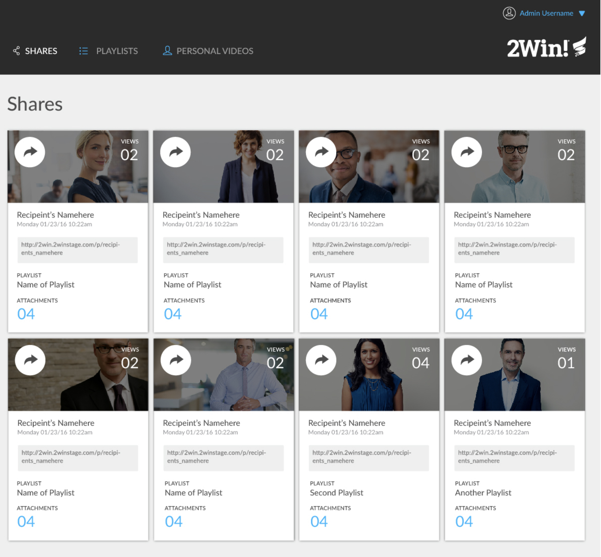
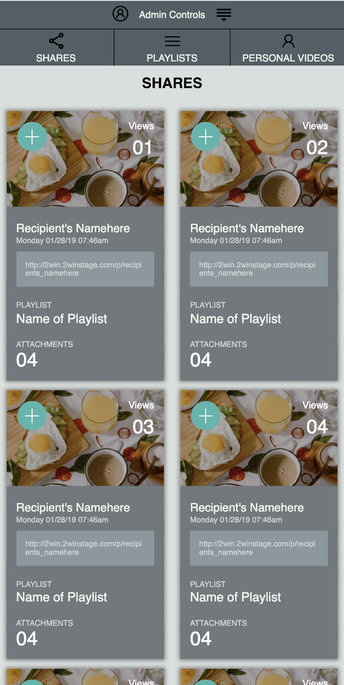

# Static Comp Challenge 1
Create a responsive page layout based on the comp provided. 

**Comp Provided**

**My Page & Responsive Layouts** 

  

### Tools used for building and testing:
- **HTML**
- **CSS**
- **Browsersync (allowed faster browser testing)**

